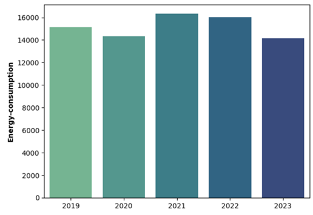
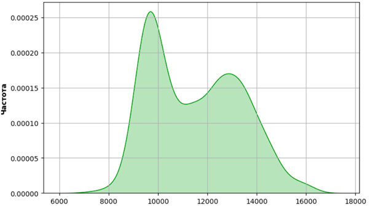
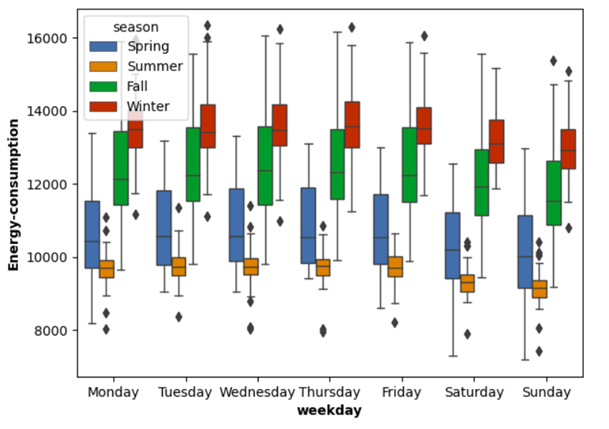
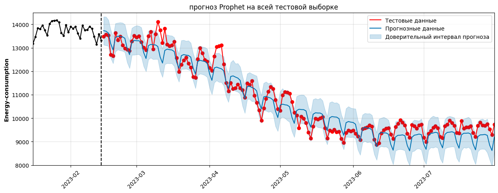
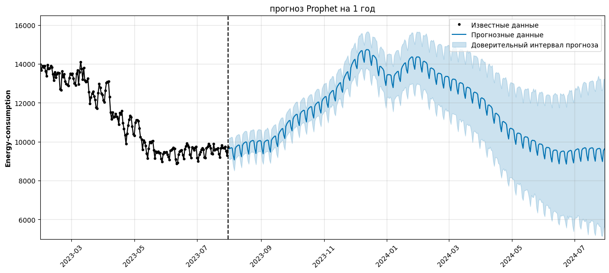

# Прогнозирование энергопотребления Калининградской области

Исследуется **прогнозирование энергопотребления Калининградской области** на основе данных только одного временного ряда энергопотребления. 

**Целью данного исследования** является разработка модели прогнозирования энергопотребления, основанной на анализе одного временного ряда данных. Таким образом, была смоделирована ситуация, когда для прогноза не известно никаких дополнительных данных, кроме предыдущих известных значений временного ряда. 

Для достижения данной цели использовались методы анализа временных рядов и прогностические модели, позволяющие оценить и предсказать будущее потребление энергии в регионе.

_Наиболее яркие моменты из исследования:_

↑ Изменения энергопотребления в Калининградской области с 2019 - 2023 гг. ↑

↑ Кривая частот суточного энергопотребления (по оси X – МВт*ч) ↑

↑ Графики, показывающие различия в энергопотреблении в различные сезоны года и дни недели. ↑

 ↓ Результаты моделирования.  ↓

